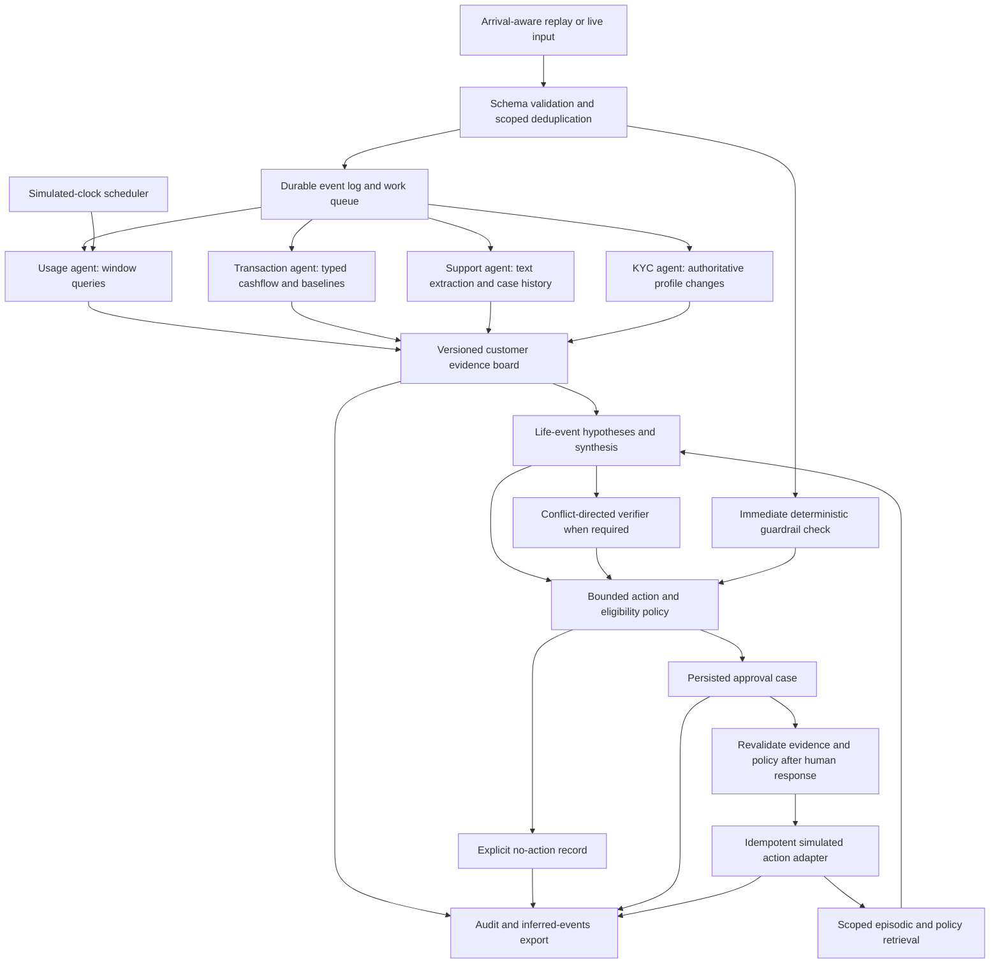

# ChronoMesh: deeper research and recommended solution

Research date: 15 September 2026. Status: architectural recommendation and dataset audit; no predictive benchmark or production implementation has been run.

## 1. Recommendation

Build a **temporal evidence and intervention system**: an arrival-aware event log, a shared customer state board, genuinely specialized agents, persistent life-event hypotheses, and a deterministic action gate with real human approval. Keep the foundation of C360-Mesh, but make evidence availability, confidence, policy eligibility, and execution status separate objects.

This is the strongest defensible choice for the supplied data and submission window, not an experimentally established global best. The practical differentiator should be **a decision that can be replayed, revised when evidence changes, and prevented from executing after its approval becomes stale**.

The problem statement gives research 30%, implementation 25%, architectural novelty 20%, trust components 15%, and documentation 10%. It requests a working end-to-end system, a research log, an architecture diagram, evaluation, and a final three-page solution document. This longer research memo supports that submission; it does not replace the three-page deliverable.

## 2. What the actual data establishes

Inspected all three research PDFs, the 12-page problem statement, and all files in `customer_360_dataset.zip`. The archive includes public `ground_truth.json` files despite the schema's description of hidden backend labels. Treat these as practice answer keys, and prevent the runtime from accessing them.

| Directory | Practice narrative | Historical events | Live events | Labeled checkpoints |
|---|---|---:|---:|---:|
| scenario_01 | Medical hardship | 375 | 116 | 3 |
| scenario_02 | New child | 296 | 110 | 2 |
| scenario_03 | Churn risk | 399 | 72 | 3 |
| Total | Three customers | 1,070 | 298 | 8 |

### Consequences and data traps

- **Three customer trajectories are not a training corpus.** Do not train a deep temporal model, causal forest, or calibrated churn classifier and claim generalization from this package. Event rows within a customer are dependent observations.
- **Event IDs collide across scenarios.** There are 103 repeated occurrences among the 298 live-event IDs alone. Namespace identity by dataset/run plus customer and source event ID. Validate account ownership; never resolve identity from names.
- **Two live events are delayed:** scenario_01 `EVT_000420` occurs March 1 and arrives March 3; scenario_02 `EVT_000341` occurs March 2 and arrives March 3. An arbitrary five-minute lateness cutoff would mishandle both.
- **Directory names differ from label identifiers:** scenario_01/02/03 map to scenario_05_major_medical_event / scenario_06_new_child / scenario_07_churn_risk in the answer keys. Map explicitly in evaluation metadata, never through narrative inference.
- **No supplied offer catalog, real action-cost table, randomized treatment history, or intervention outcomes.** Product eligibility and benefit estimates must be visibly configured demo assumptions. A proposal can request an eligibility review; it cannot assert that a customer is pre-approved without evidence.
- **Sparse balance observations are not a complete ledger.** Preserve `balance_after` as a source snapshot. Do not reconstruct exact current net worth by summing incomplete card and banking records.
- **A resolved ticket is not necessarily a satisfied customer.** In scenario_03 a `ticket_resolved` event has `resolution_status=human_rejected` and text refusing a fee waiver. Keep operational closure separate from problem resolution and dissatisfaction.
- **Internal transfers are not new wealth or external loss.** Scenario_01 moves 10,000 from savings to checking on March 15. Interpret matched legs as asset relocation, without counting two independent hardship signals.
- **Only three state classes have labeled examples.** The fixed interface contains 14 named states; fraud, retirement, relocation, and other classes need additional authored tests and must be reported as unvalidated on organizer data.

The schema says both to use fixed enums and, inconsistently, permits “others if very unique scenario.” Use the 14 named enums only until clarified. Put nuance in `notes` or `action_subtype`. The required output is a JSON array, not a nested object; keep internal audit fields in a separate file.

## 3. Research: evidence, limits, and design decisions

All links below are primary papers, official documentation, or first-party engineering accounts. Findings from chat memory, research agents, and mathematical benchmarks are design evidence, not direct demonstrations of banking decision quality. The detailed design in later sections is our proposed application of these sources.

| Source and reading scope | Finding taken from it | Decision and limitation |
|---|---|---|
| [Cemri et al., MAST, v3](https://arxiv.org/html/2503.13657v3), taxonomy and development discussion | Failures include coordination, specification, and verification issues; aggregate accuracy can conceal different failure causes. The updated work reports 1,642 traces across seven frameworks. | Typed handoffs, bounded retries, explicit arbitration, and failure-category logging. The preliminary document's five-framework/150-task description should distinguish initial taxonomy development from the expanded dataset. This does not prove our MAS outperforms one agent. |
| [Rasmussen et al., Zep](https://arxiv.org/html/2501.13956v1), memory architecture | Separates episodes from derived facts and preserves temporal relationships. Experiments concern conversational memory. | Store source events and derived hypotheses separately with validity and knowledge timestamps. Adopt temporal semantics in PostgreSQL; graph infrastructure is optional. Do not copy reported QA improvements into expected task accuracy. |
| [Wu et al., LongMemEval](https://arxiv.org/html/2410.10813v2), task definitions and evaluation | Memory involves extraction, cross-session reasoning, temporal reasoning, updates, and abstention. | Test each ability separately: recall an old life event, revise it, answer an as-of query, and admit missing evidence. Memory retention alone is not adequate evaluation. |
| [Liu et al., Lost in the Middle](https://arxiv.org/abs/2307.03172), abstract and reported context-position finding | Long-context access can depend on the position of relevant material. | Retrieve a compact evidence packet rather than concatenating every transaction. Use full-history prompting as a measured baseline; the older result does not establish failure for every current model. |
| [Adams and MacKay, Bayesian Online Changepoint Detection](https://arxiv.org/abs/0710.3742), algorithm description | Online change detection can use only observations already available and represent uncertainty in regime duration. | Compare a change detector with rolling baseline rules for engagement/income. Keep this an optional ablation: sparse, irregular banking events require an appropriate observation model. |
| [Apache Flink, event time and watermarks](https://nightlies.apache.org/flink/flink-docs-stable/docs/concepts/time/) | Event occurrence and arrival are different clocks; watermarks express progress assumptions in a delayed stream. | Separate ingestion scheduling from event-time aggregates. Borrow semantics without introducing a Flink cluster for 1,368 events. |
| [LangGraph interrupts](https://docs.langchain.com/oss/python/langgraph/interrupts) and [persistence](https://docs.langchain.com/oss/python/langgraph/persistence) | Persisted workflows can pause and resume; interrupted nodes restart, so earlier side effects may repeat. | Keep proposal, approval, and execution in separate nodes; checkpoint durably and make external effects idempotent. Checkpointing alone does not ensure exactly-once payments or messages. |
| [PostgreSQL row security](https://www.postgresql.org/docs/current/ddl-rowsecurity.html) | Row policies can enforce scope, but owners, superusers, and BYPASSRLS roles need special attention. | Agents use restricted database roles, not the owner role. Enforce customer scope and domain grants in database/tool APIs. Test negative access with the actual runtime roles. |
| [pgvector documentation](https://github.com/pgvector/pgvector), filtering section | Exact search is supported; approximate search can return too few filtered results because filtering follows index scanning. | For this dataset, exact vector search over an authorized customer subset is sufficient. Measure filtered recall before enabling HNSW; similarity filtering is not authorization. |
| [Moraes et al., Uplift Modeling](https://arxiv.org/abs/2308.09066), tutorial abstract | Treatment effect differs from baseline outcome risk; benefit and cost both matter. | Keep a constrained action ranking interface, but label present values as heuristics. No causal intervention-effect claims without treatment/outcome data and identification assumptions. |
| [Anthropic, multi-agent research system](https://www.anthropic.com/engineering/multi-agent-research-system), engineering account | Parallel work helps decomposable research, with substantial token overhead. | Specialize by data domain; activate extra verification only for actionable conflicts. Research-search gains do not justify all-to-all debate on every banking event. |
| [Anthropic, agent evaluation](https://www.anthropic.com/engineering/demystifying-evals-for-ai-agents), evaluation framework | Assess final outcomes alongside traces, and choose grading methods appropriate to the output. | Exact enum/timing checks plus human review of grounding. Do not use an LLM judge as the sole scorer for bounded action correctness. |

## 4. Architecture to implement



Implement synchronous guardrail checks before any dispatch; specialist processing is asynchronous. Every component emits trace events. The diagram is a design view, not a claim of implemented functionality.

**Stack:** Python, FastAPI, Pydantic contracts, PostgreSQL plus pgvector, a persistent LangGraph workflow, and a small table-based UI. Start with a PostgreSQL work/outbox table and one worker; add Redis Streams only if throughput or fan-out measurements warrant it. Keep an append-only log regardless of transport. Persist one customer update atomically and serialize conflicting writes by customer/version. Do not run a full graph per ordinary grocery purchase: update aggregates cheaply, then invoke semantic reasoning on changed evidence or scheduled review.

### Genuine agent boundaries

| Component | Tools/data it can access | Output and trigger |
|---|---|---|
| Usage | Authorized usage aggregates and baseline state | Engagement change and inactivity; usage events and daily timer |
| Transaction | Authorized account events and transaction features | Income regime, expense categories, transfer/refund semantics; banking events |
| Support | Redacted support text and relevant case history | Request, dissatisfaction, denial, confirmation, legal-risk evidence; text arrival |
| KYC | Profile changes and reference identity links | Authoritative changes and inconsistencies; KYC events |
| Life-event/synthesis | Structured board and scoped memories | Ranked hypotheses, supporting and opposing evidence; material board change |
| Action/eligibility | Hypotheses, versioned demo policy, intervention history | Candidate action, subtype, cost assumption, unmet conditions |
| Verifier/refiner | Proposal, citations, relevant source excerpts and policy | Specific contradiction or grounded approval recommendation; conflict/proposal trigger |

Numerical processors may be deterministic tools within specialist agents. Keep separate role schemas, prompts, tool permissions, persistent findings, and triggers. A system of renamed identical generalist prompts would not meet the intended specialization requirement.

## 5. Temporal evidence: the main design improvement

Every evidence record should include:

```text
tenant_id, dataset_namespace, customer_id, evidence_id
source_event_ids, claim_type, structured_value, source_role
event_time, available_at, valid_from, valid_to
recorded_at, superseded_at, source_group, reliability_class
supporting_or_contradicting, extractor_version, board_version
```

Use two time dimensions: when a fact applies, and when the system learned it. A March 1 event received March 3 cannot support a March 2 online decision. On March 3 it can revise the current interpretation and historical event-time aggregate, but it must not rewrite the decision that was actually made March 2.

Support two explicitly named replay modes:

1. **Benchmark compatibility:** follow the supplied event-time ordering instructions and disclose how delayed records are exposed.
2. **Operational correctness:** deliver in ingestion-time order, retain original event times for aggregation, and export decisions at the simulated clock using only available evidence.

Report both if they differ. Do not quietly backdate a detection to improve timeliness. Start a configurable 72-hour recomputation horizon for the supplied delays, and queue older late records for correction rather than dropping them. Do not delay the fast safety path until a watermark passes.

For absent events, schedule evaluation using the replay clock: otherwise a customer who stops logging in may never trigger another usage analysis. Absence counts only when the source is known to be healthy; a failed connector is not customer disengagement.

### Life-event memory and confidence

Keep multiple active hypotheses internally. Medical hardship may coexist with income disruption; new parenthood may explain an income dip that otherwise resembles job loss. Choose one primary enum for export while preserving alternatives and unresolved contradictions.

Use an interpretable evidence ladder initially:

- **Low:** plausible weak cue; preserve the hypothesis but abstain from intervention.
- **Medium:** sustained or cross-domain support, with material alternative explanations still open.
- **High:** sufficiently specific corroboration or an authoritative anchor with compatible context, and no unresolved major contradiction.

These are qualitative bands, not calibrated probabilities. An LLM saying “0.93” does not establish calibration. Attach every change in band to new or expired evidence. Group repeated events from the same underlying source so three baby-store purchases do not count as three independent confirmations.

Persist durable facts until explicit revision, such as a KYC dependents count. Separately decay relevance of temporary risk, intent, and unresolved hypotheses. A child's existence should not decay at the same rate as a recent product search. Use configurable per-type expiry/review periods and retain raw history. Do not force monotonic confidence when contradictory evidence arrives.

Retrieve current structured facts first, then linked episodes, recent corrections, and applicable policy versions. Rank semantic matches only inside authorized scope and the applicable time interval. When embeddings lag, fetch the newly arrived record directly by ID; record the index version and freshness lag. Invalidate superseded text at retrieval time even if physical cleanup runs later.

## 6. Decision policy, disagreement, and approval

Keep three questions separate: **what is happening**, **what action is appropriate**, and **may it execute now**. High confidence in new parenthood is not proof of product eligibility or consent.

Apply policy lexicographically: deterministic stop conditions; eligibility/consent; sufficient evidence and customer intent; existing case/cooldown; then configurable cost-aware ranking. Include `no_action`. Unknown affordability or product eligibility blocks automatic product execution and is shown to the reviewer. Demo costs belong in a versioned policy file, with sensitivity comparisons, not in invented benefit estimates presented as measured ROI.

For conflict, request the specific missing fact: is an inflow a refund or income; was a support issue fixed or denied; is a transfer internal? Allow one verifier pass and one revision initially. Unresolved actionable conflict goes to HITL. Debate is useful only when competing interpretations survive source verification.

**Correction to the preliminary diagram:** its low-risk autonomous-action branch must be limited to internal processing, no-action decisions, and explicitly allowed internal routing. The PS production checklist requires a real checkpoint before customer-facing or costly actions. `auto_approved` must never imply that a financial offer can be sent without that checkpoint.

Persist proposal, source snapshot, policy version, reviewer identity, decision, and modified parameters. Bind approval to a proposal version/hash. When new evidence arrives during approval, mark the old proposal stale and revalidate before resuming. An expired or changed proposal needs a fresh decision. The action adapter accepts a unique operation key; a retry must not repeat a discount or outreach. Interrupted workflows alone do not provide this guarantee.

Keep action recommendation separate from execution. An exported `personalized_offer` with `hitl_status=escalated` means a proposed intervention awaiting a human, not a sent offer. Use internal statuses such as proposed, pending, rejected, superseded, executed, and failed without adding them to the mandated enums.

**Refine evidence ablation:** remove one evidence *group* to test dependence, but do not require every justified action to survive deletion of its decisive source. Removing an explicit hardship request should sometimes change the action. Never disable hard guardrails during this diagnostic. Distinguish justified dependence, duplicated corroboration, and unexplained instability; use the result to inform review rather than automatically suppress every sensitive action.

Protect customer boundaries through scoped storage and restricted tool APIs. Do not give an LLM arbitrary SQL or the ability to choose its own tenant identity. Treat support text and retrieved documents as untrusted content; they cannot change tool permissions or approval policy. Store redacted model prompts and responses, citations, and tool results rather than hidden chain-of-thought. Keep any necessary raw PII in a separately restricted source store.

## 7. Expected scenario behavior, without hardcoded dates

These are reference requirements from the practice labels, not model results. Implement reusable evidence transitions, never customer names, IDs, or checkpoint dates.

| Scenario | Early interpretation | Transition to action | Important alternative to reject |
|---|---|---|---|
| Medical hardship | ER/pharmacy activity supports low confidence; benefits replacing normal pay plus major hospital expense raises confidence | Explicit hardship request with income and expense context supports `support_intervention`, subtype `medical_hardship_payment_plan`, escalated | Tuition is not fraud; a resort refund and internal transfer are not windfalls |
| New child | Income dip plus one baby-products purchase remains low confidence | Sustained baby/daycare evidence, education-savings intent, and dependents update support `personalized_offer`, subtype `childcare_savings_or_insurance_plan`, escalated | A large electronics purchase alone does not establish takeover; customer confirmation is relevant |
| Churn | Denied fee dispute plus reduced engagement initially remains low confidence | Cancellation intent plus major external transfer and disengagement support `relationship_manager_escalation`, subtype `premium_retention_offer_and_fee_waiver`, escalated | Tax refund is not necessarily investment intent; ticket closure does not erase dissatisfaction |

The later churn checkpoint expects `proactive_retention_outreach`. Retain the earlier intervention case and its status; do not repeatedly send messages just to match checkpoint labels. Recommending a next stage and executing another contact are separate decisions. The traces contain no real response to our intervention, so later observations remain fixed replay data; we cannot claim our outreach prevented churn.

The ideal lead-time field is underspecified. For example, the churn transfer arrives March 6 at 11:20, less than two days before the March 8 checkpoint, while the label says three ideal days. Clarify what time anchors that measure. Locally report detection delay from decisive evidence arrival and lead time to the checkpoint separately; do not claim the latter reproduces the official scorer.

## 8. Evaluation needed to establish the best variant

Build the scorer before tuning. At each reference checkpoint, select the latest eligible output at or before the cutoff for the same scenario/customer. Score only fields the reference specifies; a missing expected HITL field is not an implicit label. Validate enum/schema compliance separately. Maintain timestamped outputs on every material change and daily timer, including explicit no-action.

**Report:** per-checkpoint state/action/confidence/HITL match, joint match on specified fields, red-herring violations within each 72-hour window, first correct actionable detection time, stale-memory errors, cross-customer retrieval count, duplicate executions, unsupported citations, and approval lifecycle failures. Measure processing latency from ingestion separately from original event-to-decision delay, and separate human waiting time from model latency. Report token/call cost when actually measured.

Compare under the same event availability and output schema:

1. Transparent rules with structured history.
2. One LLM with scoped recent context and structured aggregates.
3. Hybrid specialists plus persistent temporal hypotheses.
4. Variant 3 with conflict-directed verification.

Use matched token limits or disclose cost differences. Repeat stochastic runs. Ablate temporal memory, contradiction handling, inactivity timers, and source-group deduplication individually. A win means better grounded decisions/timing at acceptable cost, not more agents in the diagram.

**Adversarial and metamorphic tests:** duplicate an event; delay it; rename every customer/merchant while preserving semantics; interleave customers; insert unrelated purchases; revoke consent; supersede policy; add a correction; paraphrase or negate a support request; inject tool instructions in retrieved text; resume approval twice; deliver new evidence during approval; make embeddings unavailable. Expected invariants include stable decisions under ID renaming and duplication, no future evidence, no unauthorized retrieval, and no duplicate execution.

Because the answer keys were inspected during design, the eight checkpoints are development regression cases. Splitting events randomly leaks customer history. Even leave-one-scenario-out is weak with one customer per class. Use independently authored, withheld customer trajectories with new amounts, merchants, timing, and confounders for a modest generalization check; report synthetic provenance and do not present them as organizer hidden-test performance. A generalization claim needs more representative independent data.

## 9. Build order through the stated September 19 deadline

Assumption: the PS's September 19 end-of-day deadline applies to this event; no new external deadline was verified.

| Stage | Concrete completion criterion |
|---|---|
| September 16: contracts, replay, reference policy, scorer | Seed history, stream all three files without future leakage, emit valid JSON, compute an honest baseline table |
| September 17: specialists and memory | Persistent evidence board; life-event carryover; supersession; live retrieval; one demonstrated conflict with trace |
| September 18: approval and failure paths | Actual approve/reject/modify/why UI; restart recovery; stale-approval rejection; idempotent simulated effects; isolation checks |
| September 19: comparison and submission | Run baselines/ablations, record failures, freeze versions, verify reproducible startup, update architecture and exactly three-page solution |

Defer Kafka/Flink deployment, graph database migration, reinforcement learning, causal uplift fitting, fine-tuning, extensive frontend work, and unconstrained agent debate. They do not resolve the highest-risk gaps in this dataset and time window.

## 10. What is established and what remains to prove

**Established by inspection:** data size/schema, included practice labels, delayed records, recurring event identifiers, exact expected actions, missing treatment/cost data, and the approval requirement. The accompanying audit script reproduces structural checks without changing the dataset.

**Recommended, not measured:** improved accuracy from temporal memory; lower cost from conditional verification; safety benefit from version-bound approval; confidence-band thresholds; and the proposed technology composition. These require the experiments above.

**Decisions still requiring project input:** available model/API and budget, compute, official checkpoint/lead-time semantics, and authoritative offer/consent/cost policy. None blocks a local replay prototype with explicitly labeled policies and simulated actions.

The best next implementation is the smallest complete vertical slice: one arriving event becomes scoped evidence, updates persistent state, produces a bounded decision, pauses for a real reviewer if required, and exports a scoreable record. Expand only after that path is reproducible.

### Local evidence and reproduction

- Problem statement: `C:/Users/deves/OneDrive/Desktop/Projects/TCMD-SS/Natural Language Processing.pdf`, especially sections 3, 6, 7, and 8.
- Preliminary sources: `01_C360_Mesh_One_Page_Approach.pdf`, `02_C360_Mesh_Preliminary_Research.pdf`, and `03_C360_Mesh_Preliminary_Architecture.pdf` in the project root.
- Dataset: `customer_360_dataset.zip`; schema README, entity records, all historical/live JSONL records, replay settings, and practice labels.
- Reproduce the structural audit from the project root with `python scripts/audit_dataset.py`. Saved output: `research/dataset_audit.json`. This audit reads labels only for dataset metadata; it is not an inference worker or performance scorer.
